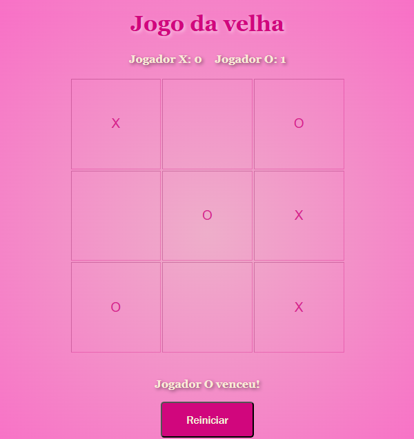

# 🎮 Jogo da Velha - HTML & JavaScript

Este projeto consiste em um Jogo da Velha estilizado com HTML, CSS e JavaScript, jogável diretamente no navegador! Com uma interface vibrante e placar dinâmico, ele permite que dois jogadores disputem rodadas e acompanhem suas vitórias.

## 🧩 Funcionalidades

- Interface responsiva e colorida com fundo em gradiente
- Tabuleiro interativo de 3x3
- Alternância entre jogadores X e O
- Exibição de mensagens informando a vez e o vencedor
- Contador de pontos por jogador
- Botão para reiniciar a partida sem perder os pontos

## 📁 Estrutura do Projeto

- `jogo da velha.html` – Arquivo principal contendo toda a estrutura HTML, estilos em CSS e lógica em JavaScript embutidos.

## 🚀 Como rodar

1. Baixe ou clone este repositório
2. Abra o arquivo `jogo da velha.html` com um navegador (Google Chrome, Firefox, Edge...)
3. Pronto! O jogo estará disponível para jogar

## 📸 Preview

Desenvolvido por 💖 com HTML + CSS + JavaScript.

